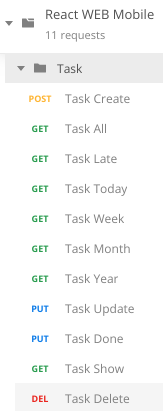
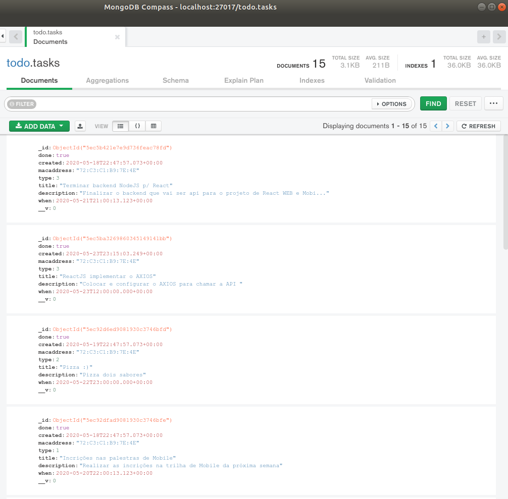

# nodejs-mongodb
Projeto de API desenvolvida com NodeJS e MongoDB

Possui dois projetos front relacionados, um feito em React e o outro em React Native.
 


## Endpoints

* Em `src/index` altere/atualize a porta do seu backend.
* Em `src/config/database` altere/atualize a url do seu MongoDB.

### Rest's existentes

Na raiz do projeto há o arquivo `React WEB Mobile.postman_collection.json` com todos os endpoints.




*Exemplos*

`urlBase: http://127.0.0.1:3333` 

 * POST
 ```
 Task Create - {{urlBase}}/task
 Body
 {
	"macaddress": "00:19:B9:FB:E2:58",
	"type": 1,
	"title": "Terminar modulo",
	"description": "Teste filter today",
	"when": "2020-05-20T22:02:13.123456"
}

 ```

 * GET
 ```
Task All - {{urlBase}}/task/filter/all/00:19:B9:FB:E2:58
Task Late - {{urlBase}}/task/filter/late/00:19:B9:FB:E2:58
Task Today - {{urlBase}}/task/filter/today/00:19:B9:FB:E2:58
Task Week - {{urlBase}}/task/filter/week/00:19:B9:FB:E2:58
Task Month - {{urlBase}}/task/filter/month/00:19:B9:FB:E2:58
Task Year - {{urlBase}}/task/filter/year/00:19:B9:FB:E2:58
Task Show - {{urlBase}}/task/5ec3cc78c3f27e7d1d88c81b

```

 * PUT
 ```
Task Update - {{urlBase}}/task/5ec3cc78c3f27e7d1d88c81b
Body
{
	"macaddress": "00:19:B9:FB:E2:58",
	"type": 1,
	"title": "Procurar Cafe",
	"description": "Pesquisar extra forte na promocao",
	"when": "2020-05-19T12:02:13.123456"
}

Task Done - {{urlBase}}/task/5ec5b421e7e9d736feac78fd/true

```

 * DELETE
 ```
Task Delete - {{urlBase}}/task/5ec3cc78c3f27e7d1d88c81b

```
 


## MongoDB Compass




## #KeepRocking
* #fullstack
* #mobile
* #react
* #nodejs
* #mongodb


### Udemy

Curso criado por Rodrigo Gonçalves Santana, link:

https://www.udemy.com/course/projeto-completo-xd-nodejs-mongodb-react-native-e-react/